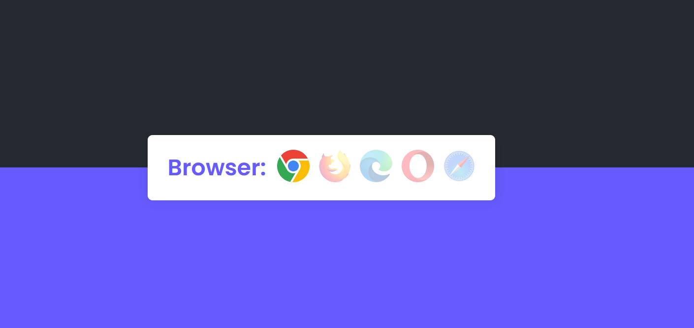

<div align="center">

# 🚀 Browser Detector
### Detect User Browser with JavaScript

<!-- Preview Image -->



<br/><br/>


</div>

---

## 📌 About The Project

This project is a **simple and practical JavaScript application** that detects the user's browser  
(Chrome, Firefox, Safari, Edge, etc.) and displays it in the UI.

It is built for **learning purposes**, **frontend practice**, and understanding how browsers expose user data using modern APIs.

---

## ✨ Features

- 🔍 Detects user browser accurately  
- 🧠 Uses `navigator.userAgent` and modern browser APIs  
- ⚡ Lightweight and fast  
- 📱 Works on desktop and mobile browsers  
- 🧩 Clean and readable code  

---

## 🛠 Tech Stack

| Technology | Purpose |
|----------|--------|
| HTML5 | Page structure |
| CSS3 | Basic styling |
| JavaScript (ES6+) | Browser detection logic |
| Git & GitHub | Version control |

---

## 📂 Project Structure

```bash
├── index.html
├── style.css
├── script.js
├── assets
│   └── preview.png
└── README.md
